# SimpleNav

<p align="center">
  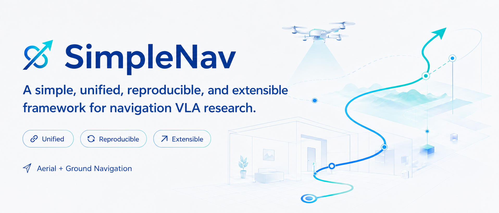
</p>

<p align="center">
  <strong>Make Navigation VLA Simple.</strong><br>
  A simple, unified, reproducible, and extensible framework for navigation VLA research.
</p>

<p align="center">
  <a href="LICENSE"></a>
  <a href="https://github.com/xwjim/SimpleNav/stargazers"></a>
  <a href="https://www.python.org/downloads/release/python-3100/"></a>
  <a href="https://simplenav.github.io/"></a>
  <a href="https://modelscope.cn/organization/SimpleNav"></a>
</p>

<p align="center">
  <a href="README_ZH.md">中文</a> ·
  <a href="https://simplenav.github.io/">Project Page</a> ·
  <a href="data_pipeline/README.md">Data Pipeline</a> ·
  <a href="docs/guides/README.md">Documentation</a> ·
  <a href="docs/guides/BENCHMARKS_RELEASE01.md">Results</a> ·
  <a href="https://modelscope.cn/organization/SimpleNav">Data, Environments &amp; Models</a>
</p>

SimpleNav is a simple, unified, reproducible, and extensible framework for navigation VLA research, jointly developed and open-sourced by THUNLP at Tsinghua University, AI9Stars, OpenBMB, and HITDIP. It provides a unified research pipeline that connects heterogeneous navigation data, long-horizon VLA models, training, and benchmark evaluation through well-defined interfaces. SimpleNav supports both aerial and ground navigation, preserves dataset-specific coordinate systems and simulator semantics through dedicated adapters, and standardizes model, action, artifact, and evaluation interfaces to enable efficient reuse, comparison, and extension across datasets, tasks, and platforms.

<details>
<summary>Table of Contents</summary>

- [SimpleNav](#simplenav)
  - [Vision](#vision)
  - [Why SimpleNav](#why-simplenav)
  - [Framework](#framework)
  - [Data Protocol](#data-protocol)
    - [Trajectory augmentation](#trajectory-augmentation)
  - [Model](#model)
  - [Results](#results)
    - [Demos](#demos)
  - [Risks and Limitations](#risks-and-limitations)
  - [Quick Start](#quick-start)
    - [1. Clone and install the model environment](#1-clone-and-install-the-model-environment)
    - [2. Prepare data](#2-prepare-data)
    - [3. Train](#3-train)
    - [4. Evaluate](#4-evaluate)
  - [Documentation](#documentation)
  - [Roadmap](#roadmap)
  - [Citation](#citation)
  - [License](#license)
  - [Acknowledgements](#acknowledgements)
</details>

## Vision

Navigation research should not require a separate data-model-evaluation stack for every dataset. SimpleNav provides one research loop in which:

- source datasets enter through explicit conversion adapters;
- model components remain replaceable and composable;
- training runs are defined by portable configs;
- benchmark-specific behavior stays inside evaluation plugins;
- results remain traceable to code, data, config, checkpoint, and simulator versions.

## Why SimpleNav

| Area | What is provided |
| --- | --- |
| Simple Data | Conversion, trajectory augmentation, AirSim image collection, LeRobot v3 writing, validation, statistics, BATS context, and visual-token cache tools. |
| Simple Model | Qwen3.5-VL navigation, long-history selection, temporal-view encoding, visual-token caching, and diffusion action heads. |
| Simple Training | Configuration-driven local, distributed, single-dataset, and mixed-dataset training. |
| Simple Evaluation | Portable OpenFly, TravelUAV, AerialVLN, EVT-Bench, R2R-CE, and RxR-CE configs with shared rollout artifacts. |

## Framework

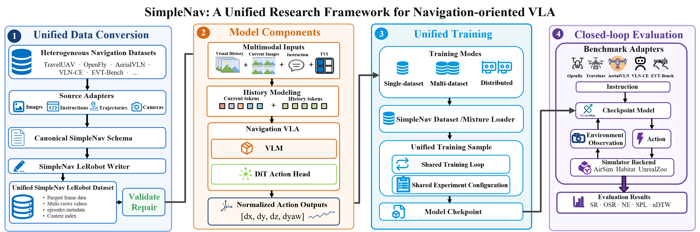

| Path | Description |
| --- | --- |
| [`data_pipeline/`](data_pipeline/README.md) | Raw-data conversion, trajectory augmentation, simulator image collection, and enhanced-data construction. |
| [`starVLA/`](starVLA/) | Dataloaders, models, training runtime, and shared modules. |
| [`examples/NavVLA/`](examples/NavVLA/) | Portable training entry points and configs. |
| [`NavVLAeval/`](NavVLAeval/README.md) | Closed-loop and offline benchmark evaluation. |
| [`tool/navvla/`](tool/navvla/README.md) | Dataset validation, repair, statistics, context, cache, and open-loop tools. |
| [`deployment/`](deployment/) | Deployment-side entry points. |
| [`docs/`](docs/guides/README.md) | Documentation for installation, data, models, training, evaluation, and results. |

## Data Protocol

The primary LeRobot dataloader keeps storage, model input, and prediction target separate:

| Field | Protocol |
| --- | --- |
| Stored `observation.state` | One pose `[x, y, z, yaw]` in the coordinate convention declared by the dataset adapter. |
| Model state | When `include_state: true`, consecutive body-frame relative motions over the selected BATS history, ending at the current frame. It is not the stored absolute pose or the future action target. |
| Primary action target | A future chunk `[H, 4]` of `[dx_forward, dy_right, dz_down, dyaw]`. Every waypoint is independently anchored at the current pose, not at the previous predicted waypoint. |
| Normalization | `dataset_statistics.json` is authoritative. Actions use per-dimension `q01`/`q99`; padded action rows are zero after normalization. |

Benchmark adapters may declare a different action Protocol when required by the benchmark. The config and adapter Protocol are authoritative. See [Data Structure and State/Action Protocol](docs/guides/DATA_STRUCTURE.md).

### Trajectory augmentation

Each animation aligns one raw trajectory with its enhanced version. Click an animation to open the MP4.

<table>
  <tr>
    <td align="center"><a href="data_pipeline/docs/assets/trajectory_comparisons/aerialvln_3018Q3ZVORO4Z811ZR054U1M4N6AR9_aligned_raw_vs_enhanced.gif">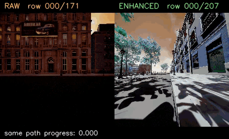</a><br><strong>AerialVLN · Example 1</strong><br>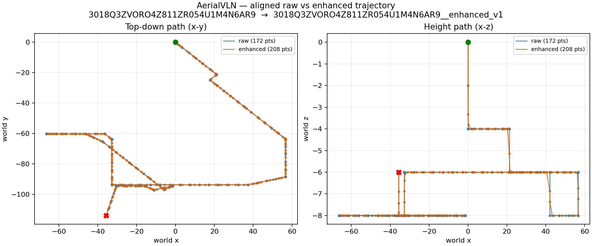</td>
    <td align="center"><a href="data_pipeline/docs/assets/trajectory_comparisons/openfly_000008_aligned_raw_vs_enhanced.gif">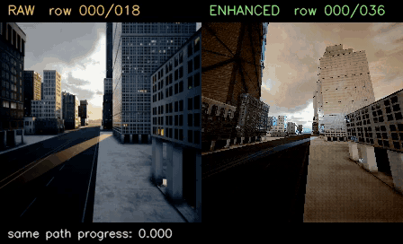</a><br><strong>OpenFly · Episode 000008</strong><br>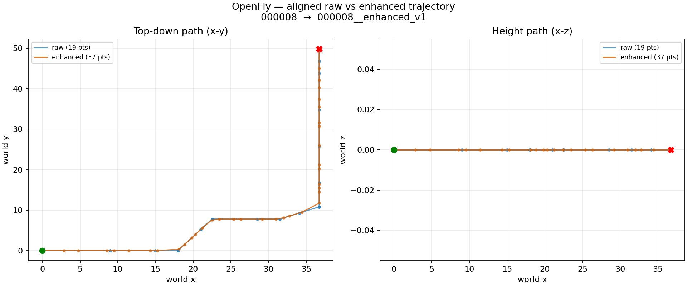</td>
  </tr>
</table>

## Model

SimpleNav combines a vision-language backbone, selected long history, temporal-view context, and a continuous action head. The model consumes the protocol above and keeps dataset-specific coordinate semantics in the adapter.

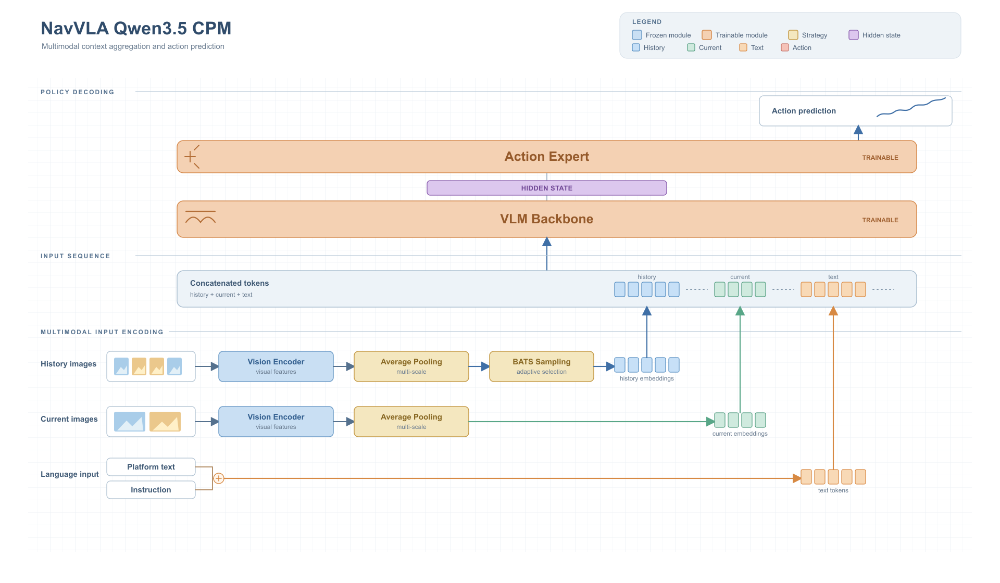


## Results

We adopt Qwen3.5-VL 4B as the unified vision-language backbone, and complete model training and closed-loop evaluation on 6 benchmarks respectively. Except for the necessary adaptation of data and task interfaces, we do not perform task-specific performance optimization for any individual benchmark.
The results are summarized as follows.
Full comparison tables and protocol notes are in [Release 01 Benchmarks](docs/guides/BENCHMARKS_RELEASE01.md).

| Benchmark | Split | NE↓ | SR↑ | OS/OSR↑ | SPL↑ | nDTW↑ | SDTW↑ |
| --- | --- | ---: | ---: | ---: | ---: | ---: | ---: |
| OpenFly | Seen | 37.1 m | 52.8 | 74.2 | 51.0 | - | - |
| TravelUAV | Test Seen / Full | 85.6 m | 22.4 | 55.1 | 20.5 | - | - |
| AerialVLN-S | Val Seen | 126.0 m | 8.4 | 18.9 | - | - | 3.4 |
| R2R-CE | Val-Unseen | 4.7 m | 49.2 | 55.9 | 45.8 | - | - |
| RxR-CE | Val-Unseen | 4.6 m | 58.4 | - | 52.2 | 74.6 | - |

| Benchmark | Task | SR↑ | TR↑ | CR↓ |
| --- | --- | ---: | ---: | ---: |
| EVT-Bench | STT | 82.8 | 93.5 | 1.2 |

### Demos

Selected rollout trajectory previews are shown below. See the [project-page video gallery](https://simplenav.github.io/#demos) for full videos.

<table>
  <tr>
    <td align="center"><a href="https://simplenav.github.io/#demos">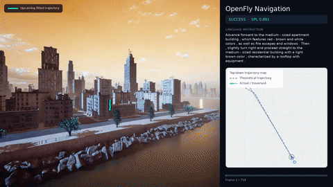</a><br><strong>OpenFly · Env 16</strong></td>
    <td align="center"><a href="https://simplenav.github.io/#demos">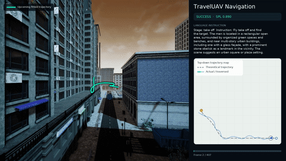</a><br><strong>TravelUAV · Modern City</strong></td>
  </tr>
  <tr>
    <td align="center">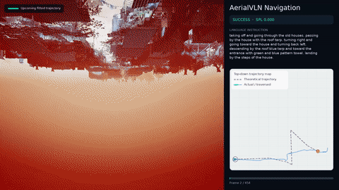<br><strong>AerialVLN · Env 8</strong></td>
    <td align="center">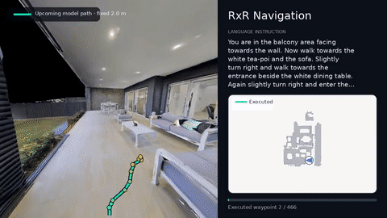<br><strong>RxR-CE · Episode 10129</strong></td>
  </tr>
  <tr>
    <td align="center"><a href="https://simplenav.github.io/#demos">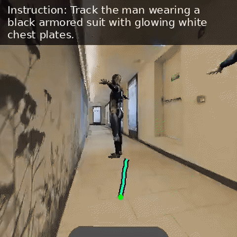</a><br><strong>EVT-Bench · Scene 2</strong></td>
    <td align="center"><a href="https://simplenav.github.io/#demos">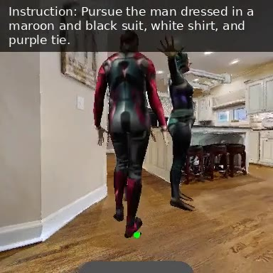</a><br><strong>EVT-Bench · Scene 30</strong></td>
  </tr>
</table>


## Risks and Limitations

- SimpleNav is a research framework, not a safety-certified flight-control system. Do not use model outputs as the sole control authority.
- Validate in simulation and controlled environments with qualified supervision, manual override, emergency stop, geofencing, and independent safety monitors.
- Performance can degrade under distribution shift, perception or communication latency, actuator/simulator mismatch, and coordinate or action-protocol errors.
- No guarantee is made for collision avoidance, fail-safe behavior, or regulatory compliance; operators remain responsible for deployment decisions.

## Quick Start

Public resources:

- [Data, environments, and models](https://modelscope.cn/organization/SimpleNav)

Place downloaded packages in the repository-relative `local/` layout below.

### 1. Clone and install the model environment

Requirements: Linux, Python 3.10, and a model-compatible NVIDIA driver. Dataset conversion also requires `ffmpeg`; closed-loop evaluation requires the corresponding simulator and scene assets.

```bash
git clone -b SimpleNav https://github.com/xwjim/SimpleNav.git SimpleNav
cd SimpleNav
curl -LsSf https://astral.sh/uv/install.sh | sh
uv python install 3.10
uv sync --frozen --no-dev
uv run --no-sync python -c "import torch, transformers; print(torch.__version__, transformers.__version__)"
```

For the Qwen3.5 reference recipe, install the optional CUDA extension after the base environment succeeds:

```bash
uv sync --frozen --no-dev --extra flash-attention
```

See [Installation](docs/guides/INSTALLATION.md) for the Conda data-tool environments and system packages.

### 2. Prepare data

Install only the data component you need. For raw-dataset conversion:

```bash
cd data_pipeline/dataset_conversion
conda env create -f environment.yml
conda activate vln-dataset-conversion
vln-convert --help
```

The other component entry points are:

```text
data_pipeline/trajectory_augmentation  -> vln-augment
data_pipeline/image_collection         -> vln-collect
```

Follow [Data Preparation](docs/guides/DATA_PIPELINE.md), then place local resources under:

```text
local/
├── models/                         # base VLMs and auxiliary models
├── data/                           # converted datasets and benchmark inputs
├── checkpoints/                    # SimpleNav checkpoints + dataset_statistics.json
├── simulators/                     # AirSim/Habitat runtimes and scene assets
├── eval_results/
└── results/
```

Validate a converted split:

```bash
uv run --no-sync python -m tool.navvla.cli.validate_dataset \
  local/data/<dataset>/<split> --visual-token-mode online_images --smoke-load 8
```

### 3. Train

The public reference recipe is OpenFly Qwen3.5-VL training:

```bash
bash examples/NavVLA/train_files/qwen35/run_train.sh \
  examples/NavVLA/train_files/qwen35/navvla_qwen35_cpm_openfly_portable.yaml \
  --dry-run

bash examples/NavVLA/train_files/qwen35/run_train.sh \
  examples/NavVLA/train_files/qwen35/navvla_qwen35_cpm_openfly_portable.yaml
```

Copy the portable config before changing data mixtures, GPU counts, or attention implementations. See [Training](docs/guides/TRAINING.md).

### 4. Evaluate

Each public config resolves paths relative to its own directory.

| Benchmark | Config | Launcher |
| --- | --- | --- |
| OpenFly | `NavVLAeval/openfly/config_portable.yaml` | `bash NavVLAeval/openfly/run_eval.sh` |
| TravelUAV | `NavVLAeval/traveluav/config_portable.yaml` | `bash NavVLAeval/traveluav/run_eval.sh` |
| AerialVLN | `NavVLAeval/aerialvln/config_portable.yaml` | `bash NavVLAeval/aerialvln/run_eval.sh` |
| AerialVLN-S Val Seen · action stop | `NavVLAeval/aerialvln/config_qwen35_tb1024_ph32_s_seen_stop_finalseg0p292_k2.yaml` | `bash NavVLAeval/aerialvln/run_eval.sh --config <config>` |
| EVT-Bench | `NavVLAeval/track/eval_qwen35_track.py` | `bash NavVLAeval/track/run_qwen35_track_eval.sh` |
| R2R-CE | `NavVLAeval/vlnce/r2r/config_portable.yaml` | `bash NavVLAeval/vlnce/r2r/run_eval.sh` |
| RxR-CE | `NavVLAeval/vlnce/rxr/config_portable.yaml` | `bash NavVLAeval/vlnce/rxr/run_eval.sh` |

Inspect a two-episode plan before starting a simulator:

```bash
bash NavVLAeval/openfly/run_eval.sh --dry-run \
  --override benchmark.max_samples=2 \
  --override parallel.gpu_ids='[0]' \
  --override output.run_name=openfly_dry_run
```

See [Evaluation](docs/guides/EVALUATION.md) for resource layout, execution, resume, and artifacts.

For the OpenFly, AerialVLN, and TravelUAV data-to-training-to-evaluation workflow, use [Aerial Training and Evaluation](docs/guides/AERIAL_TRAINING_AND_EVALUATION.md).

For the released R2R-CE and RxR-CE Qwen3.5 workflow, use [VLN-CE Training and Evaluation](docs/guides/VLNCE_TRAINING_AND_EVALUATION.md).

## Documentation

| Task | Document |
| --- | --- |
| Install environments | [Installation](docs/guides/INSTALLATION.md) |
| Convert, augment, and render data | [Data Preparation](docs/guides/DATA_PIPELINE.md) |
| Understand state/action semantics | [Data Structure and State/Action Protocol](docs/guides/DATA_STRUCTURE.md) |
| Understand or extend the model | [Model Architecture](docs/guides/MODEL_ARCHITECTURE.md) |
| Find model and checkpoint entries | [Models and Checkpoints](docs/guides/MODELS_AND_CHECKPOINTS.md) |
| Train a model | [Training](docs/guides/TRAINING.md) |
| Reproduce mixed EVT-Bench training/evaluation | [EVT_BENCH_RECIPE](docs/guides/EVT_BENCH_RECIPE.md) |
| Run a benchmark | [Evaluation](docs/guides/EVALUATION.md) |
| Reproduce OpenFly, AerialVLN, and TravelUAV training/evaluation | [Aerial Training and Evaluation](docs/guides/AERIAL_TRAINING_AND_EVALUATION.md) |
| Reproduce R2R-CE and RxR-CE training/evaluation | [VLN-CE Training and Evaluation](docs/guides/VLNCE_TRAINING_AND_EVALUATION.md) |
| Inspect complete results | [Release 01 Benchmarks](docs/guides/BENCHMARKS_RELEASE01.md) |
| Read the project direction | [Vision and Roadmap](docs/guides/VISION_AND_ROADMAP.md) |

## Roadmap

- Maintain released checkpoints, model cards, converted-data manifests, dataset cards, and simulator packages.
- Add portable multi-domain training recipes and extend the released single-dataset workflows.
- Expand model backbones, history and memory modules, action heads, and platform adapters.
- Publish reproducible result bundles with resolved configs and episode-level artifacts.
- Connect evaluation failures to data generation and the next training iteration.

## Citation

If SimpleNav is useful in your work, please cite the repository.

```bibtex
@software{simplenav,
  title = {SimpleNav: Make Navigation VLA Simple},
  author = {{SimpleNav Contributors}},
  year = {2026},
  url = {https://github.com/OpenBMB/SimpleNav},
}
```

## License

Repository source code is released under the [MIT License](LICENSE). Datasets, pretrained models, simulators, scene assets, and third-party components retain their own licenses.

## Acknowledgements
We thank pioneering navigation VLA studies, including NavFoM, Qwen-RobotNav, ABot-N0, starVLA and InternVLA-N1, whose valuable explorations have helped shape and advance this field.

SimpleNav builds upon starVLA, Qwen-VL, LeRobot, PyTorch, Transformers, DeepSpeed, AirSim, Habitat, as well as the datasets and benchmarks described above. We gratefully acknowledge these open-source contributions and encourage users to cite the original projects and datasets employed in their experiments.
