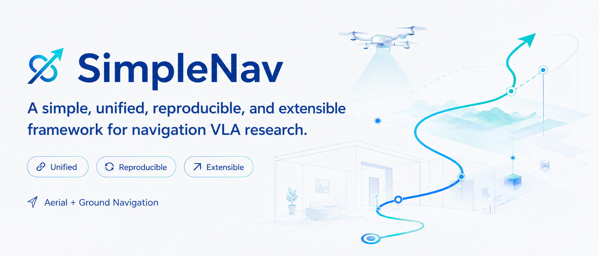
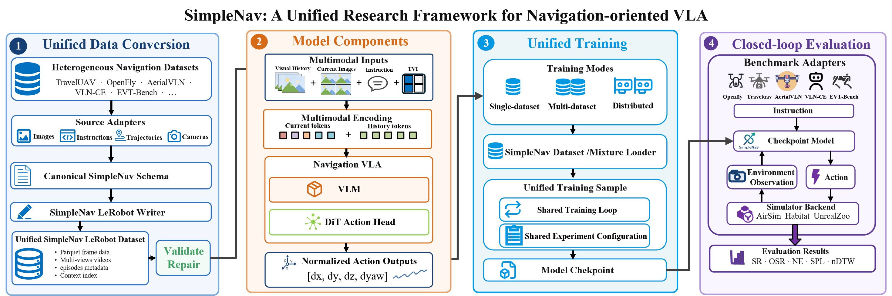
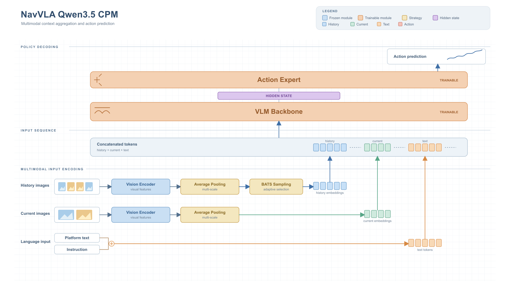
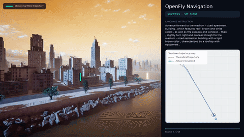
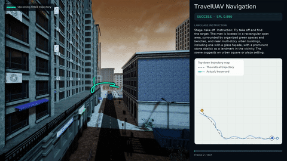
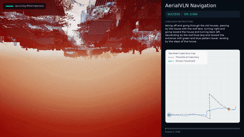
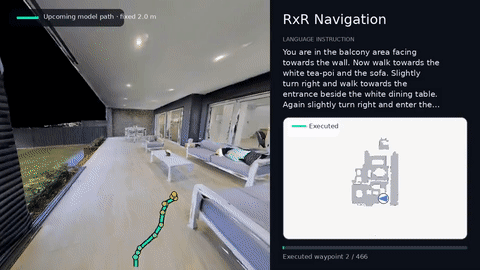
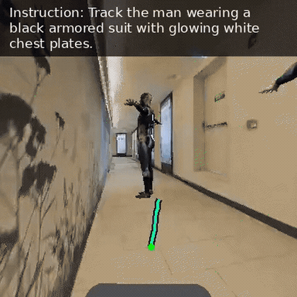
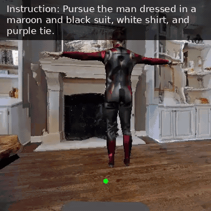

<p align="center">
  
</p>

<p align="center">
  <strong>Make Navigation VLA Simple.</strong><br>
  A simple, unified, reproducible, and extensible framework for navigation VLA research.
</p>

<p align="center">
  <a href="LICENSE"></a>
  <a href="https://github.com/OpenBMB/SimpleNav/stargazers"></a>
  <a href="https://www.python.org/downloads/release/python-3100/"></a>
  <a href="https://simplenav.github.io/"></a>
  <a href="https://modelscope.cn/organization/SimpleNav"></a>
</p>

<p align="center">
  <a href="https://simplenav.github.io/">Project Page</a> ·
  <a href="data_pipeline/README.md">Data Pipeline</a> ·
  <a href="docs/guides/README.md">Documentation</a> ·
  <a href="docs/guides/BENCHMARKS_RELEASE01.md">Results</a> ·
  <a href="https://modelscope.cn/organization/SimpleNav">Data, Environments &amp; Models</a>
</p>

SimpleNav is a simple, unified, reproducible, and extensible framework for navigation VLA research, jointly developed and open-sourced by THUNLP at Tsinghua University, AI9Stars, OpenBMB, and HITDIP. It provides a unified research pipeline that connects heterogeneous navigation data, long-horizon VLA models, training, and benchmark evaluation through well-defined interfaces. SimpleNav supports both aerial and ground navigation, preserves dataset-specific coordinate systems and simulator semantics through dedicated adapters, and standardizes model, action, artifact, and evaluation interfaces to enable efficient reuse, comparison, and extension across datasets, tasks, and platforms.

<details>
<summary>Table of Contents</summary>

- [Why SimpleNav](#why-simplenav)
- [Framework](#framework)
- [Data Protocol](#data-protocol)
- [Model](#model)
- [Results](#results)
  - [Demos](#demos)
- [Quick Start](#quick-start)
  - [1. Clone and install the shared uv environment](#1-clone-and-install-the-shared-uv-environment)
  - [2. Prepare data](#2-prepare-data)
  - [3. Train](#3-train)
  - [4. Evaluate](#4-evaluate)
- [Documentation](#documentation)
- [Roadmap](#roadmap)
- [Risks and Limitations](#risks-and-limitations)
- [Citation](#citation)
- [License](#license)
- [Acknowledgements](#acknowledgements)
</details>

## Why SimpleNav

| Area | What is provided |
| --- | --- |
| Simple Data | Conversion, trajectory augmentation, AirSim image collection, LeRobot v3 writing, validation, statistics, BATS context, and visual-token cache tools. |
| Simple Model | Qwen3.5-VL navigation, long-history selection, temporal-view encoding, visual-token caching, and diffusion action heads. |
| Simple Training | Configuration-driven local, distributed, single-dataset, and mixed-dataset training. |
| Simple Evaluation | Portable OpenFly, TravelUAV, AerialVLN, EVT-Bench, R2R-CE, and RxR-CE configs with shared rollout artifacts. |

## Framework



| Path | Description |
| --- | --- |
| [`data_pipeline/`](data_pipeline/README.md) | Raw-data conversion, trajectory augmentation, simulator image collection, and enhanced-data construction. |
| [`starVLA/`](starVLA/) | Dataloaders, models, training runtime, and shared modules. |
| [`examples/NavVLA/`](examples/NavVLA/) | Portable training entry points and configs. |
| [`benchmark/`](benchmark/README.md) | Closed-loop and offline benchmark evaluation. |
| [`tool/navvla/`](tool/navvla/README.md) | Dataset validation, repair, statistics, context, cache, and open-loop tools. |
| [`deployment/`](deployment/) | Deployment-side entry points. |
| [`docs/`](docs/guides/README.md) | Documentation for installation, data, models, training, evaluation, and results. |

## Data Protocol

The primary LeRobot dataloader keeps storage, model input, and prediction target separate:

| Field | Protocol |
| --- | --- |
| Stored `observation.state` | One pose `[x, y, z, yaw]` in the coordinate convention declared by the dataset adapter. |
| Model state | When `include_state: true`, consecutive body-frame relative motions over the selected BATS history, ending at the current frame. It is not the stored absolute pose or the future action target. |
| Primary action target | A future chunk `[H, 4]` of `[dx_forward, dy_right, dz_down, dyaw]`. Every waypoint is independently anchored at the current pose, not at the previous predicted waypoint. |
| Normalization | `dataset_statistics.json` is authoritative. Actions use per-dimension `q01`/`q99`; padded action rows are zero after normalization. |

Benchmark adapters may declare a different action Protocol when required by the benchmark. The config and adapter Protocol are authoritative. See [Data Structure and State/Action Protocol](docs/guides/DATA_STRUCTURE.md).

## Model

SimpleNav combines a vision-language backbone, selected long history, temporal-view context, and a continuous action head. The model consumes the protocol above and keeps dataset-specific coordinate semantics in the adapter.




## Results

We adopt Qwen3.5-VL 4B as the unified vision-language backbone, and complete model training and closed-loop evaluation on 6 benchmarks respectively. Except for the necessary adaptation of data and task interfaces, we do not perform task-specific performance optimization for any individual benchmark.
The results are summarized as follows.
Full comparison tables and protocol notes are in [Release 01 Benchmarks](docs/guides/BENCHMARKS_RELEASE01.md).

| Benchmark | Split | NE↓ | SR↑ | OS/OSR↑ | SPL↑ | nDTW↑ | SDTW↑ |
| --- | --- | ---: | ---: | ---: | ---: | ---: | ---: |
| OpenFly | Seen | 37.1 m | 52.8 | 74.2 | 51.0 | - | - |
| TravelUAV | Test Seen / Full | 85.6 m | 22.4 | 55.1 | 20.5 | - | - |
| AerialVLN-S | Val Seen | 126.0 m | 8.4 | 18.9 | - | - | 3.4 |
| R2R-CE | Val-Unseen | 4.7 m | 49.2 | 55.9 | 45.8 | - | - |
| RxR-CE | Val-Unseen | 4.6 m | 58.4 | - | 52.2 | 74.6 | - |

| Benchmark | Task | SR↑ | TR↑ | CR↓ |
| --- | --- | ---: | ---: | ---: |
| EVT-Bench | STT | 82.8 | 93.5 | 1.2 |

### Demos

Animated rollout previews are shown below. Click an animation to play the full rollout video hosted on the project website. More videos are available in the [project-page video gallery](https://simplenav.github.io/#demos).

<table>
  <tr>
    <td align="center"><a href="https://simplenav.github.io/assets/demos/openfly/env16_ep000420.mp4"></a><br><strong>OpenFly · Env 16</strong></td>
    <td align="center"><a href="https://simplenav.github.io/assets/demos/traveluav/moderncity_ep000405.mp4"></a><br><strong>TravelUAV · Modern City</strong></td>
  </tr>
  <tr>
    <td align="center"><a href="https://simplenav.github.io/assets/demos/aerialvln/env8.mp4"></a><br><strong>AerialVLN · Env 8</strong></td>
    <td align="center"><a href="https://simplenav.github.io/assets/demos/rxr/ep10129.mp4"></a><br><strong>RxR-CE · Episode 10129</strong></td>
  </tr>
  <tr>
    <td align="center"><a href="https://simplenav.github.io/assets/demos/evt_bench/scene2.mp4"></a><br><strong>EVT-Bench · Scene 2</strong></td>
    <td align="center"><a href="https://simplenav.github.io/assets/demos/evt_bench/scene30.mp4"></a><br><strong>EVT-Bench · Scene 30</strong></td>
  </tr>
</table>


## Quick Start

Public resources:

- [Data, environments, and models](https://modelscope.cn/organization/SimpleNav)

Place native dependency wheels in the repository-relative `third_party/wheels/` directory. Place data, environment, and model packages in the `local/` layout below.

### 1. Clone and install the shared uv environment

One root `pyproject.toml` installs the `SimpleNav` project into the root `.venv`. Base includes models, training, DINO, dataset conversion, trajectory augmentation, and common evaluation tools. The data-pipeline directories are source modules in this project, with six console commands; they are not separate distributions or uv workspace members.

Simulator dependencies are optional and selected by simulator, not by benchmark:

| Installation | Includes | Typical use |
| --- | --- | --- |
| Base (no extra) | Models, training, DINO, conversion, augmentation, offline tools | Train from prepared data; convert or augment any supported dataset |
| `--extra airsim` | Base + AirSim 1.8.1 and RPC client | OpenFly, TravelUAV, AerialVLN; pipeline image collection |
| `--extra habitat` | Base + Habitat-Sim/Lab 0.3.1 and Magnum | R2R-CE, RxR-CE, EVT-Bench; VLN-CE image rendering |
| `--extra unrealcv` | Base + UnrealCV SDK and Gym | UnrealZoo backend; also supply its external `gym_unrealcv` plugin and scene assets through runtime config |

TravelUAV's DINO dependencies are in base. Benchmark data, scenes, and model weights are downloaded separately. VLN-CE conversion of already rendered data needs only base; online VLN-CE evaluation/rendering requires Habitat.

Python is fixed to 3.10.12; `uv.lock` pins dependencies, and ordinary packages use the Tsinghua index. Base includes CUDA training libraries: use Linux x86_64, a CUDA 12.4 toolkit and compatible NVIDIA driver, GCC/G++, and FFmpeg/FFprobe with H.264 support. Set `CUDA_HOME` to your toolkit; DeepSpeed requires an executable `bin/nvcc`. AirSim rendering additionally needs Vulkan and scene executables. Habitat source builds additionally need CMake, Ninja, and EGL/OpenGL development libraries.

```bash
sudo apt-get install build-essential python3.10-dev libjpeg-dev ffmpeg
git clone -b SimpleNav https://github.com/OpenBMB/SimpleNav.git SimpleNav
cd SimpleNav
curl -LsSf https://astral.sh/uv/install.sh | sh
export CUDA_HOME=/usr/local/cuda-12.4
export UV_PROJECT_ENVIRONMENT="$PWD/.venv"
```

#### Base wheels and installation

Download the FlashAttention and causal-conv1d wheels to the exact repository-relative paths below. Both are required by base and target Python cp310, Linux x86_64, Torch 2.6, CUDA 12, and C++ ABI FALSE. Habitat-Sim and Magnum are only needed when selecting `habitat`.

| Package | Version | Source | Required relative path |
| --- | --- | --- | --- |
| Habitat-Sim | 0.3.1 | Built from the pinned submodule above | `third_party/wheels/habitat_sim-0.3.1-cp310-cp310-linux_x86_64.whl` |
| Magnum (with Corrade bindings) | 0.0.0 | Built from Habitat-Sim's dependencies above | `third_party/wheels/magnum-0.0.0-cp310-cp310-linux_x86_64.whl` |
| FlashAttention | 2.7.4.post1+cu12torch2.6cxx11abiFALSE | [Official release download](https://github.com/Dao-AILab/flash-attention/releases/download/v2.7.4.post1/flash_attn-2.7.4.post1%2Bcu12torch2.6cxx11abiFALSE-cp310-cp310-linux_x86_64.whl) | `third_party/wheels/flash_attn-2.7.4.post1+cu12torch2.6cxx11abiFALSE-cp310-cp310-linux_x86_64.whl` |
| causal-conv1d | 1.5.0.post8+cu12torch2.6cxx11abiFALSE | [Official release download](https://github.com/Dao-AILab/causal-conv1d/releases/download/v1.5.0.post8/causal_conv1d-1.5.0.post8%2Bcu12torch2.6cxx11abiFALSE-cp310-cp310-linux_x86_64.whl) | `third_party/wheels/causal_conv1d-1.5.0.post8+cu12torch2.6cxx11abiFALSE-cp310-cp310-linux_x86_64.whl` |

Wheels are ignored by Git; the source manifest and patches stay tracked. Download the two base wheels from the official releases:

```bash
mkdir -p third_party/wheels
curl -fL 'https://github.com/Dao-AILab/flash-attention/releases/download/v2.7.4.post1/flash_attn-2.7.4.post1%2Bcu12torch2.6cxx11abiFALSE-cp310-cp310-linux_x86_64.whl' \
  -o third_party/wheels/flash_attn-2.7.4.post1+cu12torch2.6cxx11abiFALSE-cp310-cp310-linux_x86_64.whl
curl -fL 'https://github.com/Dao-AILab/causal-conv1d/releases/download/v1.5.0.post8/causal_conv1d-1.5.0.post8%2Bcu12torch2.6cxx11abiFALSE-cp310-cp310-linux_x86_64.whl' \
  -o third_party/wheels/causal_conv1d-1.5.0.post8+cu12torch2.6cxx11abiFALSE-cp310-cp310-linux_x86_64.whl
```

Install base, then select the simulator(s) you need:

```bash
uv sync --frozen                                # base
uv sync --frozen --extra airsim                 # base + AirSim
# Or, after preparing the Habitat wheels below:
uv sync --frozen --extra habitat                # base + Habitat
# Or:
uv sync --frozen --extra unrealcv               # base + UnrealCV
# Multiple simulators in the same environment:
uv sync --frozen --extra airsim --extra habitat
```

Each sync selects the complete set of extras to keep: repeat all desired extras on subsequent syncs. `uv sync --frozen` with no extras returns to base. Use `--frozen` for installations from the committed lock so unselected simulators do not require their local wheels or source checkouts. Run commands with `uv run --no-sync` after installation. `--extra dev` adds development tools.

Core versions remain Torch 2.6.0/cu124, torchvision 0.21.0, Transformers 5.12.1, DeepSpeed 0.16.9, NumPy 1.26.4, PyArrow 14.0.1, and Pillow 12.2.0. Export `CUDA_HOME` in the shell used for training; launchers and evaluation workers select the root `.venv` directly.

#### Habitat only: source build

Skip this section for base, AirSim, or UnrealCV installations. Habitat-Sim is a Git submodule pinned to revision `3d6d67d6deae4ab2472cc84df7a3cef1503f606d` (0.3.1), also recorded in `third_party/sources.json`. Its NumPy patch remains tracked at `third_party/patches/habitat-sim-numpy126.patch`; applying it leaves an expected local modification inside the submodule.

Install base first, then install the build prerequisites and build Habitat-Sim and Magnum/Corrade with the root interpreter. The patch check supports an already patched checkout:

```bash
sudo apt-get install cmake ninja-build libglm-dev libegl1-mesa-dev libgl1-mesa-dev
```

```bash
git submodule update --init --recursive --jobs 4
git -C third_party/habitat-sim apply --reverse --check ../patches/habitat-sim-numpy126.patch 2>/dev/null || \
  git -C third_party/habitat-sim apply ../patches/habitat-sim-numpy126.patch

cd third_party/habitat-sim
../../.venv/bin/python setup.py build_ext --parallel 8 bdist_wheel \
  --headless --bullet --skip-install-magnum --no-update-submodules --no-lto
cp dist/habitat_sim-0.3.1-cp310-cp310-linux_x86_64.whl ../wheels/
cd ../..

repo_root=$PWD
(
  cd third_party/habitat-sim/build/temp.linux-x86_64-cpython-310/deps/magnum-bindings/src/python
  "$repo_root/.venv/bin/python" setup.py bdist_wheel -d "$repo_root/third_party/wheels"
)
```

The build enables headless EGL and Bullet; RGB rendering does not require `--with-cuda`. Habitat-Lab 0.3.1 is installed from fixed Git revision `142616776544f918c19e7f0392b65cc8cc69fa13`. Track tasks use the same installed Habitat-Lab.

If locally rebuilt wheels differ from the committed hashes, refresh their lock entries before installation (lock maintenance requires all four local wheels):

```bash
uv lock --refresh-package habitat-sim --refresh-package magnum
uv lock --check
uv sync --frozen --extra habitat
uv pip check --python .venv/bin/python
uv run --no-sync python -c "import habitat_sim; print(habitat_sim.__version__)"
```

If the Habitat wheels already match the lock, run `uv sync --frozen --extra habitat` directly. Include any other simulator extras you want to retain.

### 2. Prepare data

The converter is already installed in the shared environment:

```bash
uv run --no-sync vln-convert --help
```

The other component entry points are:

```text
data_pipeline/trajectory_augmentation  -> vln-augment
data_pipeline/image_collection         -> vln-collect
```

Follow [Data Preparation](docs/guides/DATA_PIPELINE.md), then place local resources under:

```text
local/
├── models/                         # base VLMs and auxiliary models
├── data/                           # converted datasets and benchmark inputs
├── checkpoints/                    # SimpleNav checkpoints + dataset_statistics.json
├── simulators/                     # AirSim/Habitat runtimes and scene assets
├── eval_results/
└── results/
```

Validate a converted split:

```bash
uv run --no-sync python -m tool.navvla.cli.validate_dataset \
  local/data/<dataset>/<split> --visual-token-mode online_images --smoke-load 8
```

### 3. Train

The public reference recipe is OpenFly Qwen3.5-VL training:

```bash
bash examples/NavVLA/train_files/qwen35/run_train.sh \
  examples/NavVLA/train_files/qwen35/navvla_qwen35_cpm_openfly_portable.yaml \
  --dry-run

bash examples/NavVLA/train_files/qwen35/run_train.sh \
  examples/NavVLA/train_files/qwen35/navvla_qwen35_cpm_openfly_portable.yaml
```

Copy the portable config before changing data mixtures, GPU counts, or attention implementations. See [Training](docs/guides/TRAINING.md).

### 4. Evaluate

Each public config resolves paths relative to its own directory.

| Benchmark | Config | Launcher |
| --- | --- | --- |
| OpenFly | `benchmark/openfly/config_portable.yaml` | `bash benchmark/openfly/run_eval.sh` |
| TravelUAV | `benchmark/traveluav/config_portable.yaml` | `bash benchmark/traveluav/run_eval.sh` |
| AerialVLN | `benchmark/aerialvln/config_portable.yaml` | `bash benchmark/aerialvln/run_eval.sh` |
| AerialVLN-S Val Seen · action stop | `benchmark/aerialvln/config_qwen35_tb1024_ph32_s_seen_stop_finalseg0p292_k2.yaml` | `bash benchmark/aerialvln/run_eval.sh --config <config>` |
| EVT-Bench | `benchmark/track/eval_qwen35_track.py` | `bash benchmark/track/run_qwen35_track_eval.sh` |
| R2R-CE | `benchmark/vlnce/r2r/config_portable.yaml` | `bash benchmark/vlnce/r2r/run_eval.sh` |
| RxR-CE | `benchmark/vlnce/rxr/config_portable.yaml` | `bash benchmark/vlnce/rxr/run_eval.sh` |

Inspect a two-episode plan before starting a simulator:

```bash
bash benchmark/openfly/run_eval.sh --dry-run \
  --override benchmark.max_samples=2 \
  --override parallel.gpu_ids='[0]' \
  --override output.run_name=openfly_dry_run
```

See [Evaluation](docs/guides/EVALUATION.md) for resource layout, execution, resume, and artifacts.

For the OpenFly, AerialVLN, and TravelUAV data-to-training-to-evaluation workflow, use [Aerial Training and Evaluation](docs/guides/AERIAL_TRAINING_AND_EVALUATION.md).

For the released R2R-CE and RxR-CE Qwen3.5 workflow, use [VLN-CE Training and Evaluation](docs/guides/VLNCE_TRAINING_AND_EVALUATION.md).

## Documentation

| Task | Document |
| --- | --- |
| Install the shared environment | [README environment setup](#1-clone-and-install-the-shared-uv-environment) |
| Convert, augment, and render data | [Data Preparation](docs/guides/DATA_PIPELINE.md) |
| Understand state/action semantics | [Data Structure and State/Action Protocol](docs/guides/DATA_STRUCTURE.md) |
| Understand or extend the model | [Model Architecture](docs/guides/MODEL_ARCHITECTURE.md) |
| Find model and checkpoint entries | [Models and Checkpoints](docs/guides/MODELS_AND_CHECKPOINTS.md) |
| Train a model | [Training](docs/guides/TRAINING.md) |
| Reproduce mixed EVT-Bench training/evaluation | [EVT_BENCH_RECIPE](docs/guides/EVT_BENCH_RECIPE.md) |
| Run a benchmark | [Evaluation](docs/guides/EVALUATION.md) |
| Reproduce OpenFly, AerialVLN, and TravelUAV training/evaluation | [Aerial Training and Evaluation](docs/guides/AERIAL_TRAINING_AND_EVALUATION.md) |
| Reproduce R2R-CE and RxR-CE training/evaluation | [VLN-CE Training and Evaluation](docs/guides/VLNCE_TRAINING_AND_EVALUATION.md) |
| Inspect complete results | [Release 01 Benchmarks](docs/guides/BENCHMARKS_RELEASE01.md) |
| Read the project direction | [Vision and Roadmap](docs/guides/VISION_AND_ROADMAP.md) |

## Roadmap

- Maintain released checkpoints, model cards, converted-data manifests, dataset cards, and simulator packages.
- Add portable multi-domain training recipes and extend the released single-dataset workflows.
- Expand model backbones, history and memory modules, action heads, and platform adapters.
- Publish reproducible result bundles with resolved configs and episode-level artifacts.
- Connect evaluation failures to data generation and the next training iteration.

## Risks and Limitations

SimpleNav is a research framework whose performance may vary across environments and platforms. Validate models in simulation and controlled settings before deployment, with human oversight and independent safety measures; operators remain responsible for safe use.

## Citation

If SimpleNav is useful in your work, please cite the repository.

```bibtex
@software{simplenav,
  title = {SimpleNav: Make Navigation VLA Simple},
  author = {{SimpleNav Contributors}},
  year = {2026},
  url = {https://github.com/OpenBMB/SimpleNav},
}
```

## License

Repository source code is released under the [MIT License](LICENSE). Datasets, pretrained models, simulators, scene assets, and third-party components retain their own licenses.

## Acknowledgements
We thank pioneering navigation VLA studies, including NavFoM, Qwen-RobotNav, ABot-N0, starVLA and InternVLA-N1, whose valuable explorations have helped shape and advance this field.

SimpleNav builds upon starVLA, Qwen-VL, LeRobot, PyTorch, Transformers, DeepSpeed, AirSim, Habitat, as well as the datasets and benchmarks described above. We gratefully acknowledge these open-source contributions and encourage users to cite the original projects and datasets employed in their experiments.
