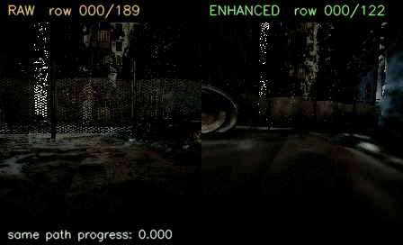
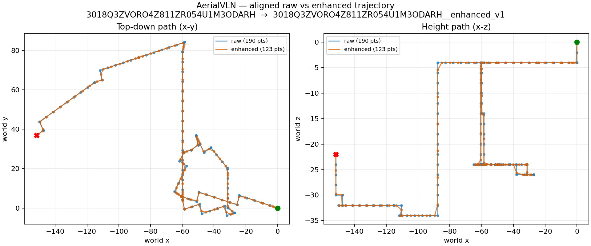
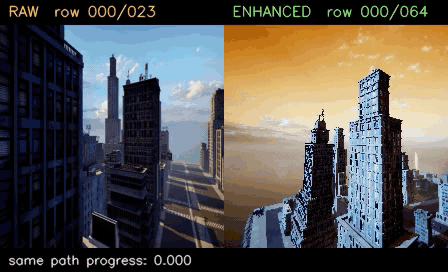
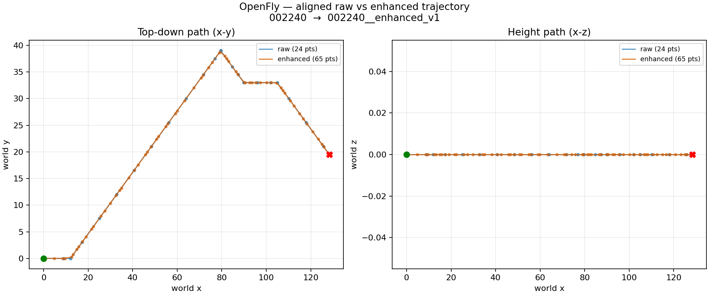

# VLN Trajectory Augmentation and Image Collection Pipeline

[SimpleNAV](../README.md) · [Chinese](README_ZH.md)

This directory is the data-construction layer of the SimpleNAV monorepo.

This directory provides an end-to-end VLN data pipeline from raw-dataset normalization through trajectory augmentation, AirSim image collection, and enhanced-dataset conversion:

```text
raw navigation dataset
  -> dataset_conversion
  -> NavVLA LeRobot v3 vln_train + a proven absolute-world-pose source
  -> trajectory_augmentation
  -> trajectory-only package (trajectories and render requests)
  -> image_collection
  -> four-view RGB videos and collection metadata
  -> dataset_conversion --adapter enhanced_vln
  -> complete trainable enhanced LeRobot split
```

Raw inputs and the source `vln_train` remain read-only. Trajectory augmentation creates a new package and image collection adds rendered videos and metadata. That package is not yet trainable; the final `enhanced_vln` conversion writes independent observation/action Parquet files, metadata, statistics, and compact BATS context.

## Trajectory Augmentation Examples

The following examples compare source and enhanced trajectories from AerialVLN and OpenFly. The videos align the two sequences by normalized cumulative 3-D path progress: **RAW** is shown on the left and **ENHANCED** on the right. In the trajectory plots, blue denotes the source samples, orange denotes the enhanced samples, the green marker is the start, and the red marker is the terminal point.

Click a video preview to open the corresponding H.264 MP4, or click a trajectory plot to view it at full resolution.

### AerialVLN

#### 172 → 208 samples

<p align="center">
  <a href="https://simplenav.github.io/assets/augmentation/aerialvln_3018Q3ZVORO4Z811ZR054U1M4N6AR9_aligned_raw_vs_enhanced.mp4">
    
  </a>
</p>

<a href="docs/assets/trajectory_comparisons/aerialvln_3018Q3ZVORO4Z811ZR054U1M4N6AR9_trajectory_raw_vs_enhanced.png">
  
</a>

#### 190 → 123 samples

<p align="center">
  <a href="https://simplenav.github.io/assets/augmentation/aerialvln_3018Q3ZVORO4Z811ZR054U1M3ODARH_aligned_raw_vs_enhanced.mp4">
    
  </a>
</p>

<a href="docs/assets/trajectory_comparisons/aerialvln_3018Q3ZVORO4Z811ZR054U1M3ODARH_trajectory_raw_vs_enhanced.png">
  
</a>

### OpenFly

#### 19 → 37 samples

<p align="center">
  <a href="https://simplenav.github.io/assets/augmentation/openfly_000008_aligned_raw_vs_enhanced.mp4">
    
  </a>
</p>

<a href="docs/assets/trajectory_comparisons/openfly_000008_trajectory_raw_vs_enhanced.png">
  
</a>

#### 24 → 65 samples

<p align="center">
  <a href="https://simplenav.github.io/assets/augmentation/openfly_002240_aligned_raw_vs_enhanced.mp4">
    
  </a>
</p>

<a href="docs/assets/trajectory_comparisons/openfly_002240_trajectory_raw_vs_enhanced.png">
  
</a>

## Repository Layout

```text
data_pipeline/
├── README.md
├── README_ZH.md
├── outputs/trajectory_comparisons/  # Generated comparison media (published on the project site)
├── dataset_conversion/        # Raw/enhanced packages to NavVLA LeRobot v3
├── trajectory_augmentation/   # Pose recovery, smoothing, resampling, and request export
└── image_collection/          # AirSim four-view RGB collection and publishing
```

- [Dataset conversion guide](dataset_conversion/README.md)
- [Trajectory augmentation guide](trajectory_augmentation/README.md)
- [Image collection guide](image_collection/README.md)

Each component uses a separate Python 3.10 Conda environment.

## 0. Convert raw data to the common format

If the input is not already NavVLA LeRobot v3, install the converter and run the matching adapter:

```bash
cd dataset_conversion
conda env create -f environment.yml
conda activate vln-dataset-conversion

vln-convert \
  --adapter aerialvln \
  --source-root /path/to/raw/AerialVLN \
  --output-root /path/to/AerialVLN_lerobot \
  --dataset-name vln_train \
  --split train \
  --write-workers 8 \
  --validate
```

The converter supports TravelUAV, AerialVLN, VLN-CE, FLIGHT, IndoorUAV, HUGE, EmbodiedNav, OpenFly, OpenScene, nuScenes, and collected Enhanced VLN packages. CosFly uses the separate two-step `vln-cosfly` entry point.

A successful artifact validation does not prove that `observation.state` is a simulator world pose. Before augmentation, still verify the original annotation, episode/scene/length identity, axes, z convention, and yaw units.

## 1. Data Placement and Required Format

Datasets and AirSim scenes are external inputs. They do not need to be copied into this Git repository. Store them anywhere with sufficient space and pass their absolute paths through `--dataset-root`, `--package-dir`, `--env-archive-root`, and `--env-cache-root`.

### LeRobot dataset root

Each dataset must contain a LeRobot-format `vln_train` split and a source of canonical absolute world poses:

```text
/path/to/Dataset_lerobot/
├── vln_train/
│   ├── meta/
│   │   ├── info.json
│   │   └── episodes/
│   │       └── chunk-XXX/part-XXX.parquet
│   └── data/
│       └── chunk-XXX/part-XXX.parquet
└── <world-pose annotation path referenced by the profile>
```

Minimum data requirements:

- `meta/info.json` describes the split and its `data_path` template.
- Episode metadata Parquet files contain `episode_index`, `episode_id`, `scene_id`, `length`, `data/chunk_index`, and `data/file_index`. `trajectory_id`, `task_index`, and `tasks` are supported when present.
- Data Parquet files contain `episode_index`, contiguous `frame_index`, and `observation.state` for every frame.
- Absolute world poses must come from a profile adapter, `meta/navvla_frame_metadata.jsonl`, or an explicitly declared absolute `observation.state`. Do not assume an unknown `observation.state` is a simulator pose.

Built-in dataset layouts:

| Dataset | Dataset root content | Built-in profile |
| --- | --- | --- |
| AerialVLN | `vln_train/` and `aerialvln_json/train.json` | `profiles/aerialvln.json` |
| OpenFly | `vln_train/` and `openfly_env/Annotation/train.json` | `profiles/openfly.json` |
| Custom dataset | `vln_train/` and an annotation path defined in a custom profile | `profiles/new-dataset-template.json` |

For a custom annotation schema, implement a pose adapter that returns finite absolute `[x, y, z, yaw_radians]` poses with exactly one pose per source frame.

### AirSim scene root

The image collector accepts extracted scene directories and AerialVLN scene ZIP archives. A conventional scene root looks like:

```text
/path/to/AirSim_scenes/
├── env_1/
│   └── LinuxNoEditor/AirVLN.sh
├── env_2.zip
└── env_airsim_16/
    └── LinuxNoEditor/start.sh
```

AerialVLN scenes normally use names such as `env_1` and may be provided as directories or ZIP archives. OpenFly scenes use names such as `env_airsim_16` and should be provided as extracted directories containing `LinuxNoEditor/start.sh`. Scene identifiers must match the `scene_id` values in the render requests. `--env-cache-root` points to a separate writable directory used for extracted or linked scene caches.

## 2. Output Locations and Formats

### Trajectory augmentation output

For a dataset root `/path/to/Dataset_lerobot`, the formal output is a new sibling of `vln_train`:

```text
/path/to/Dataset_lerobot/
├── vln_train/                   # read-only source
└── vln_train_enhanced/          # generated trajectory package
    ├── manifest.json
    ├── validation.json
    ├── trajectory_metrics.jsonl
    ├── trajectories/
    │   ├── train.json
    │   ├── episodes.jsonl
    │   └── augmentation_metadata.jsonl
    ├── render/render_requests.jsonl
    └── validation/
```

The output directory must not exist before export. The exporter never overwrites an existing file, directory, or symbolic link.

### Image collection output

Image collection publishes into the same `vln_train_enhanced` package:

```text
vln_train_enhanced/
├── videos/
│   ├── front_image/chunk-NNN/part-NNN.mp4
│   ├── back_image/chunk-NNN/part-NNN.mp4
│   ├── left_image/chunk-NNN/part-NNN.mp4
│   └── right_image/chunk-NNN/part-NNN.mp4
└── meta/
    ├── navvla_video_index.parquet
    ├── navvla_multiview_frame_metadata.jsonl
    ├── navvla_episode_camera_parameters.jsonl
    └── navvla_cameras.json
```

Temporary render files are stored under `<package-dir>/.render_staging/<run-id>/`. Resume state is stored under `<env-cache-root>/.waypoint_collector_state/<run-id>/state.sqlite3` unless `--state-root` is provided.

## 3. Complete Workflow

### Step 1: Convert or prepare the dataset and scenes

Use `dataset_conversion` to create, or otherwise prepare, the required LeRobot dataset while retaining a verifiable canonical-world-pose source. If images will be collected, also prepare the AirSim scene root and a writable scene-cache directory.

### Step 2: Install the trajectory environment

```bash
cd trajectory_augmentation
conda env create -f environment.yml
conda activate vln-trajectory-augmentation
```

### Step 3: Select or create a profile

Use `profiles/aerialvln.json`, `profiles/openfly.json`, or copy `profiles/new-dataset-template.json` for another dataset. All profile paths are relative to `--dataset-root`.

### Step 4: Run profile checks and a dry run

```bash
vln-augment validate-profile \
  --profile profiles/aerialvln.json \
  --dataset-root /path/to/AerialVLN_lerobot

vln-augment export-profile \
  --profile profiles/aerialvln.json \
  --dataset-root /path/to/AerialVLN_lerobot \
  --dry-run
```

For a new dataset, first restrict `selection.include_episode_indices` to a small set covering every scene and inspect the resulting trajectories and rendered examples.

### Step 5: Export and check the trajectory package

```bash
vln-augment export-profile \
  --profile profiles/aerialvln.json \
  --dataset-root /path/to/AerialVLN_lerobot

vln-augment validate-trajectory-package \
  --package-dir /path/to/AerialVLN_lerobot/vln_train_enhanced
```

### Step 6: Install the image-collection environment

```bash
cd ../image_collection
conda env create -f environment.yml
conda activate vln-image-collection
```

### Step 7: Run preflight, prepare scenes, and collect a pilot

Use the same `--run-id` and arguments for all commands:

```bash
vln-collect preflight \
  --package-dir /path/to/AerialVLN_lerobot/vln_train_enhanced \
  --env-archive-root /path/to/AirSim_scenes \
  --env-cache-root /path/to/scene-cache \
  --gpus 0 --workers 1 \
  --run-id waypoint-v1

vln-collect prepare-envs \
  --package-dir /path/to/AerialVLN_lerobot/vln_train_enhanced \
  --env-archive-root /path/to/AirSim_scenes \
  --env-cache-root /path/to/scene-cache \
  --gpus 0 --workers 1 \
  --run-id waypoint-v1 --resume

vln-collect pilot \
  --package-dir /path/to/AerialVLN_lerobot/vln_train_enhanced \
  --env-archive-root /path/to/AirSim_scenes \
  --env-cache-root /path/to/scene-cache \
  --gpus 0 --workers 1 \
  --run-id waypoint-v1 --resume
```

Inspect `<package-dir>/.render_staging/<run-id>/pilot/contact_sheet.png`. Confirm that the drone is in the correct scene, above the ground, and facing a plausible direction, and that all four views have the correct color order.

### Step 8: Resume the complete collection run

After approving the pilot, keep the same `run-id` and collection configuration. Completed stages are reused because the command uses `--resume`:

```bash
vln-collect run \
  --package-dir /path/to/AerialVLN_lerobot/vln_train_enhanced \
  --env-archive-root /path/to/AirSim_scenes \
  --env-cache-root /path/to/scene-cache \
  --gpus 0 \
  --workers 1 \
  --views front,back,left,right \
  --image-width 224 \
  --image-height 224 \
  --run-id waypoint-v1 \
  --resume
```

The package's render resolution must exactly match `--image-width` and `--image-height`. Publishing occurs only after rendering, assembly, and package checks finish successfully.

For multi-GPU collection, choose the final `--gpus` and `--workers` values before `preflight` and keep them unchanged for every stage of that run.

### Step 9: Build the complete enhanced LeRobot split

After four-view collection and package validation, return to the conversion environment and write the enhanced split to a new independent destination:

```bash
conda activate vln-dataset-conversion

vln-convert \
  --adapter enhanced_vln \
  --source-root /path/to/AerialVLN_lerobot/vln_train_enhanced \
  --output-root /path/to/enhanced_vln_lerobot/AerialVLN \
  --dataset-name vln_train_enhanced_lerobot \
  --split train \
  --load-workers 8 \
  --validate
```

Do not write the target back into the source dataset root. The target must not exist, and the converter checks enhanced trajectories, scenes, frame indexes, four-view videos, and camera parameters before publishing.
