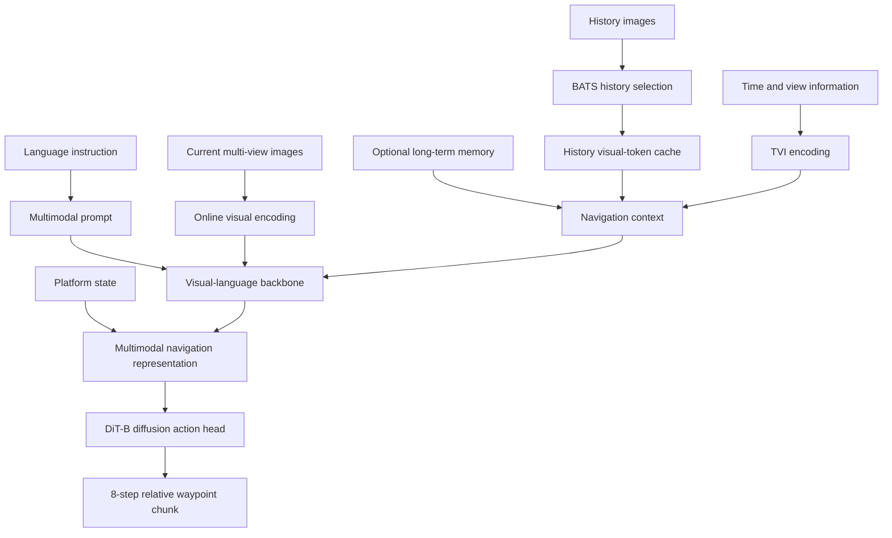

# SimpleNAV Model Architecture

[Back to the main README](../../README.md) · [中文](MODEL_ARCHITECTURE_ZH.md)

## Positioning

SimpleNAV targets long-horizon Vision-and-Language Navigation. Given language instructions, current multi-view observations, platform state, and visual history, the model predicts a continuous navigation-action segment. The architecture focuses on four capabilities:

1. retain fine-grained information from the current observation;
2. select and encode long history under a limited token budget;
3. include time, view, and platform state in the navigation representation;
4. support aerial, ground, and indoor waypoint navigation through continuous action chunks.

## Release 01 data flow




## Inputs and memory

Language describes the target or route, while the platform description distinguishes motion and observation conditions. Prompts, tokenizer behavior, and action placeholders must match the checkpoint.

The current frame uses online visual features for the latest scene, obstacles, and targets. Datasets may provide one or multiple views, but camera order, resolution, and preprocessing must be configured explicitly.

- **BATS** selects representative history under a token budget.
- **TVI** encodes temporal and view relationships.
- **Visual-token cache** avoids repeated encoding of frozen visual features.
- **Long-term memory** provides optional compressed context for longer trajectories.

Current observations and cached history use distinct paths. Their checkpoint, resize, cache stage, and token contracts must match exactly.

## Visual-language backbones

| Model path | Role | Current position |
| --- | --- | --- |
| `navvla_qwen35_cpm` | Qwen3.5-VL for language, current vision, and history context | Primary Release 01 path |

The current Qwen3.5-VL configuration freezes the complete visual module and trains navigation context and action-generation components. See [Qwen3.5-VL CPM implementation](QWEN35_CPM_IMPLEMENTATION.md) for visual and cache contracts.

## Action head and output protocol

The DiT-B conditional diffusion head produces a fixed-horizon relative waypoint chunk:

```text
action shape = [8, 4]
action[t]    = [dx_forward, dy_right, dz_down, dyaw_right_positive]
```

Each waypoint is expressed relative to the current anchor in the body frame. Conversion, training normalization, model output, denormalization, and closed-loop execution must share this meaning. Executing all eight waypoints and executing only the first waypoint are distinct evaluation protocols.

Stored pose, optional model state, and future action are separate tensors. See [Data Structure and State/Action Protocol](DATA_STRUCTURE.md).

## Extension contracts

### New visual-language backbone

Define tokenizer and visual inputs, current/history token paths, multimodal embedding insertion, visual-freezing policy, cache support and matching rules, and action-query dimensions.

### New history or memory module

Reuse unified episode/frame references and keep dataset paths out of the model. Document token budget, selection timing, temporal encoding, current-frame deduplication, and online update rules.

### New action representation

Planned directions include alternative continuous horizons, discrete navigation actions, hierarchical planning and control, stop or velocity channels, safety constraints, and platform-specific action adapters. They must extend explicit protocols rather than silently change checkpoint output semantics.

### World models and planning

Future components may predict visual features, trajectory candidates, subgoals, or environment state and compose them with the action head. Their outputs, supervision, and evaluation protocols must be recorded separately.

## Toward a general VLN model

- Move from isolated datasets to cross-dataset and cross-platform models.
- Move from a fixed visual backbone to configurable model components.
- Move from short-history prediction to long-term memory and hierarchical planning.
- Support multiple action spaces instead of one continuous waypoint protocol.
- Progress from simulator rollouts to real-time real-platform control.
- Evaluate unseen scenes, instructions, platforms, and domain transfer.

## Reproduction requirements

A public model needs its structure and backbone version, tokenizer/prompt/action-placeholder contract, image/camera/history settings, data mixture and action protocol, resolved training config and source revision, checkpoint and license, evaluation config, and raw results.
