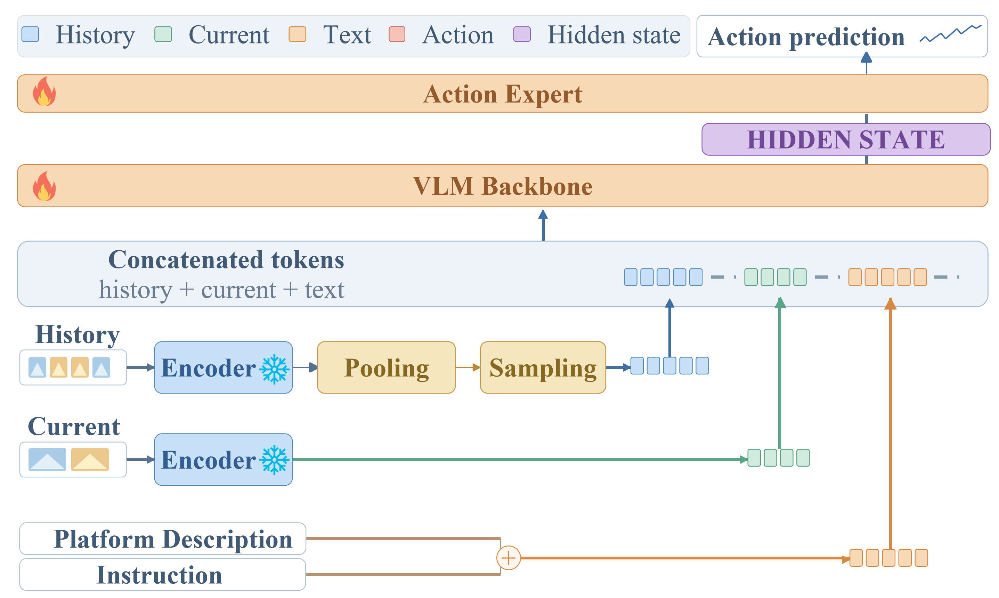
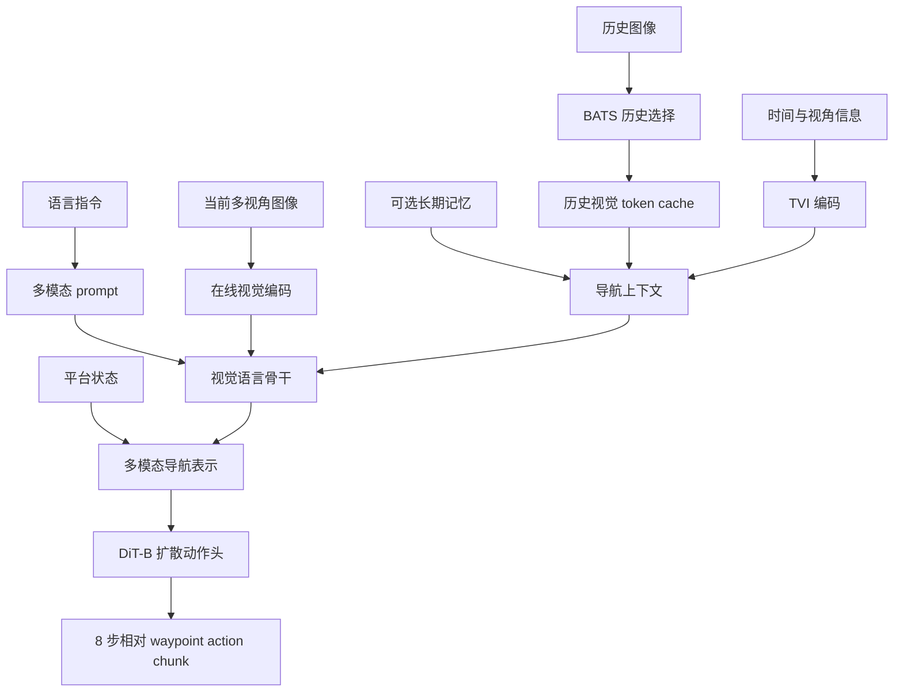

# SimpleNAV 模型架构

[返回中文 README](../../README_ZH.md)

## 定位

SimpleNAV 模型面向长时序视觉语言导航。模型需要根据语言指令、当前多视角观测、平台状态和历史视觉上下文，预测一段连续导航动作。当前架构强调四个能力：

1. 保留当前画面的细粒度视觉信息；
2. 在有限 token 预算下选择和编码长历史；
3. 让时间、视角和平台状态进入导航表示；
4. 通过连续 action chunk 支持空中、地面和室内 waypoint 导航。

## Release 01 数据流





## 输入

### 语言与平台描述

语言输入描述目标、路线或交互要求。平台描述用于区分无人机、地面机器人等不同运动和观测条件。prompt、tokenizer 和 action placeholder 必须与模型 checkpoint 保持一致。

### 当前视觉观测

当前帧保持较完整的在线视觉特征，用于感知最新场景、障碍和目标。不同数据集可以使用单视角或多视角，但相机顺序、尺寸和预处理必须写入配置。

### 历史与长期记忆

- **BATS：** 在 token budget 下选择具有代表性的历史帧。
- **TVI：** 编码历史帧的时间和视角关系。
- **视觉 token cache：** 缓存冻结视觉塔产生的历史特征，减少重复编码。
- **长期记忆：** 为更长轨迹保留可选的压缩上下文。

当前观测与历史 cache 使用不同路径：当前图像在线编码并保留更多 token，历史图像可以使用压缩后的缓存 token。二者的 checkpoint、resize、cache stage 和 token contract 必须完全匹配。

## 视觉语言骨干

Release 01 提供两条主要路径：

| 模型路径 | 作用 | 当前定位 |
| --- | --- | --- |
| `navvla_qwen35_cpm` | 使用 Qwen3.5-VL 处理语言、当前视觉和历史上下文 | 主要模型路径 |

当前 Qwen3.5-VL 配置冻结完整视觉模块，并训练面向导航的上下文与动作生成组件。视觉路径、cache 格式和 checkpoint 校验见 [Qwen3.5-VL CPM 实现](QWEN35_CPM_IMPLEMENTATION.md)。

## 动作头与输出协议

当前动作头为条件扩散模型 DiT-B，输出固定 horizon 的连续相对 waypoint：

```text
action shape = [8, 4]
action[t]    = [dx_forward, dy_right, dz_down, dyaw_right_positive]
```

每个 waypoint 相对当前 anchor 的机体坐标系表示。数据转换、训练归一化、模型输出、反归一化和闭环执行必须使用同一语义。

存储位姿、可选模型 state 与未来 action 是三类不同张量，详见[数据结构与 State/Action 协议](DATA_STRUCTURE_ZH.md)。

动作 chunk 的执行方式属于评测协议的一部分：完整执行八个 waypoint 与只执行第一个 waypoint 会改变控制频率、历史更新和闭环反馈，不能直接混合比较。

## 模型扩展接口

### 更换视觉语言骨干

新的 backbone adapter 应明确：

- tokenizer 与视觉输入协议；
- 当前图像和历史图像的 token 路径；
- 多模态 embedding 注入位置；
- 视觉模块冻结策略；
- cache 是否支持，以及 cache 与 checkpoint 的匹配规则；
- action query 和 action head 的条件维度。

### 增加历史或记忆模块

新的历史模块应复用统一的 episode/frame 引用，不把数据集路径写入模型。模块需要说明 token budget、选择时机、时间编码、当前帧去重和在线更新规则。

### 增加动作表示

未来计划支持：

- 不同 horizon 的连续相对 waypoint；
- 离散导航动作；
- 高层规划与低层控制的分层动作；
- 带停止、速度或安全约束的混合动作；
- 面向不同平台的动作 adapter。

这些表示应通过动作协议和 action head 扩展，不能隐式改变现有 checkpoint 的输出语义。

### 增加世界模型与规划模块

未来可以在统一模型接口下探索预测视觉特征、轨迹候选、子目标或环境状态的世界模型，并与动作头组合。规划模块的输出、监督信号和评测方式需要独立记录。

## 从当前模型到通用 VLN 模型

SimpleNAV 后续模型研究将围绕：

- 从单数据集模型发展到跨数据集和跨平台模型；
- 从固定视觉骨干发展到可配置的模型组件库；
- 从短历史动作预测发展到长期记忆和分层规划；
- 从单一连续 waypoint 发展到多种动作空间；
- 从模拟器闭环发展到实时真实平台控制；
- 评估未见场景、未见指令、未见平台和跨域泛化。

## 复现要求

公开一个 SimpleNAV 模型至少需要：

- 模型结构与 backbone 版本；
- tokenizer、prompt 和 action placeholder contract；
- 输入图像、相机与历史设置；
- 数据 mixture、统计键和动作协议；
- resolved training config 与代码提交；
- checkpoint、模型卡和许可证；
- 对应 evaluation config 与原始结果。
